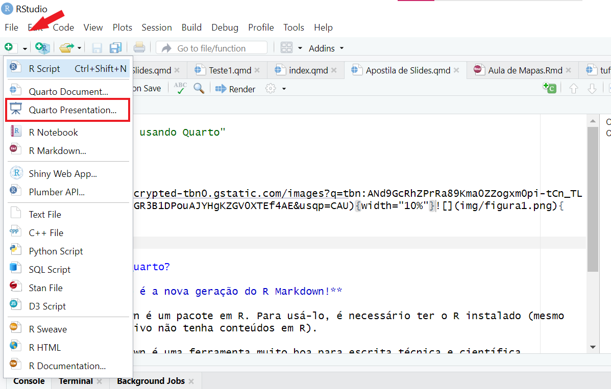
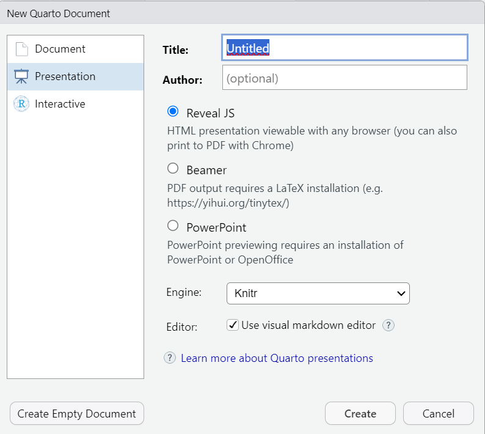
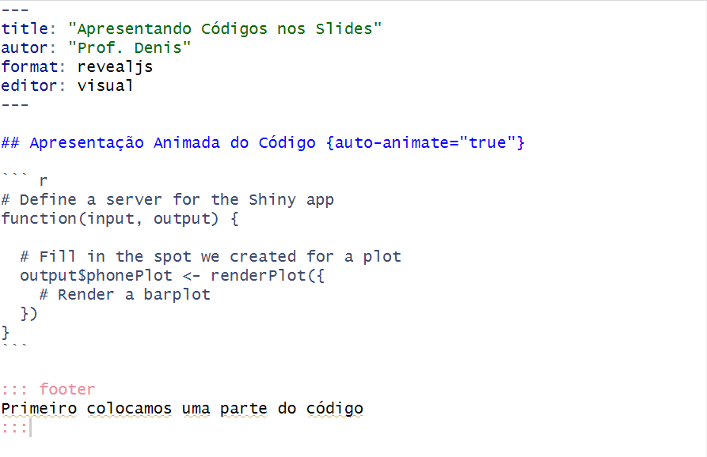
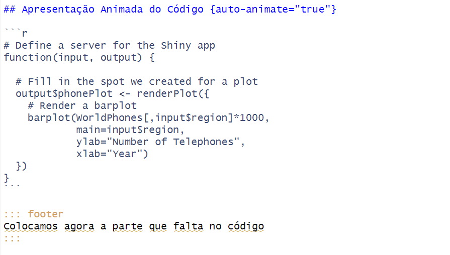
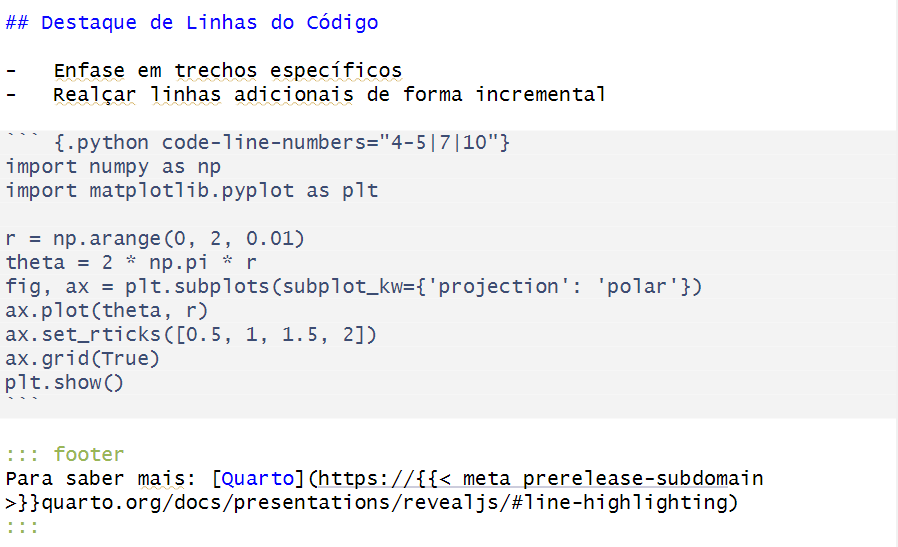
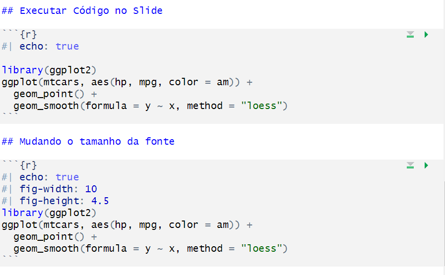

{width="10%"}{width="10%"}

## O que é o Quarto?

- **O Quarto é a nova geração do R Markdown!**

- O rmarkdown é um pacote em R. Para usá-lo, é necessário ter o R instalado (mesmo que o seu arquivo não tenha conteúdos em R).

- O R Markdown é uma ferramenta muito boa para escrita técnica e científica reprodutível, possibilitando criar vários tipos de documentos. Porém, **o seu uso acaba ficando limitado às pessoas que usam R**.

- **O Quarto é um software novo, que não depende do R**!

## Comandos Básicos de Apresentação

Para iniciar uma apresentação clicamos em:

{width="60%"}\
Na sequência temos:

{width="60%"}\
Colocamos o título e escolhemos entre três opções:

- `Reveal JS` - usado para formato Html e impressão pdf -\> [Site Revealjs](https://quarto.org/docs/presentations/revealjs/)

- `Beamer` - usado com formato Latex e impressão pdf -\> [Site Beamer](https://quarto.org/docs/presentations/beamer.html)

- `PowerPoint` - usado em formato PPtx do MS Office -\> [Site PowerPoint](https://quarto.org/docs/presentations/powerpoint.html)

### Criando Slides

Em Markdown, os slides são delimitados por meio de títulos. Por exemplo, aqui está uma apresentação de slides simples com dois slides (cada um definido com um título de nível 2 ( `##`)):

```{r}
#| eval: false
#| echo: true
---
title: "Como aprender Macroeconomia"
autor: "Prof. Denis"
format: revealjs
editor: visual
---

## Primeiro Passo

Leia todos os livros da Bibliografia até entender tudo!
Estude de madrugada e nos finais de semana.

## Segundo Passo

Aprenda a executar o primeiro passo
```

<iframe src="slide1.html" width="100%" height="400">

</iframe>

Os slides também podem ser separados por traços horizontais:

```{r}
#| eval: false
#| echo: true
---
title: "Como aprender Macroeconomia"
autor: "Prof. Denis"
format: revealjs
editor: visual
---

--- 

Primeiro Passo

Leia todos os livros da Bibliografia até entender tudo!
Estude de madrugada e nos finais de semana.

---

Segundo Passo 

Aprenda a executar o primeiro passo
```

Você também pode dividir as apresentações de slides em seções, com slides de título usando um cabeçalho de nível 1 ( `#`). Por exemplo:

```{r}
#| eval: false
#| echo: true
---
title: "Como aprender Macroeconomia"
autor: "Prof. Denis"
format: revealjs
editor: visual
---

# Macroeconomia I

## Primeiro Passo

Leia todos os livros da Bibliografia até entender tudo! Estude de madrugada e nos finais de semana.

## Segundo Passo

Aprenda a executar o primeiro passo

# Macroeconomia II

## Primeiro Passo

Aprenda Macroeconomia I primeiro.
```

<iframe src="slide2.html" width="100%" height="400">

</iframe>

### Estilos de apresentação de slide e de texto

Podemos usar a função `incremental` para que o texto apareça de maneira pausada:

```{r}
#| eval: false
#| echo: true
---
title: "Tópicos importantes em Economia"
autor: "Prof. Denis"
format: revealjs
editor: visual
---

## Macroeconomia

::: {.incremental}
-   Modelo Clássico
-   Modelo Keynesiano
-   Modelo IS/LM
:::

## Microeconomia

::: {.nonincremental}
-   Demanda e Oferta
-   Estruturas de Mercado
-   Teoria dos Jogos
:::
```

<iframe src="slide4.html" width="100%" height="400">

</iframe>

A apresentação das informações em cada Slide pode ser feita de diversas maneiras:

```{r}
#| eval: false
#| echo: true
---
title: "Alguns tipos de apresentação de  texto no Slide"
autor: "Prof. Denis"
format: revealjs
editor: visual
---

## Fragmentos

Exibição incremental de texto e animação:

<br/>

::: {.fragment .fade-in}
Apresentação suave do Texto
:::

::: {.fragment .fade-up}
O texto desliza para cima
:::

::: {.fragment .fade-left}
A frase desliza para esquerda
:::

::: {.fragment .fade-in-then-semi-out}
Entrada gradual e depois saída gradual
:::

. . .

::: {.fragment .strike}
O texto é tachado após a apresentação  
:::

::: {.fragment .highlight-red}
A frase ganha destaque com uma cor
:::
```

<iframe src="slide5.html" width="100%" height="400">

</iframe>

Também é possível dividir um slide em colunas:

```{r}
#| eval: false
#| echo: true
---
title: "Divisão de Slides em Colunas"
autor: "Prof. Denis"
format: revealjs
editor: visual
---

## Curso de Ciências Econômicas {.smaller}

Eixos Principais do curso:

::: {.fragment .fade-left}
-   Macroeconomia
-   Microeconomia
:::

::: footer
Exemplo sem divisão de colunas
:::

## Matérias por Eixo {.smaller}

::: columns
::: {.column width="50%"}
#### Macroeconomia

-   Macroeconomia I
-   Macroeconomia II
-   Economia do Setor Público
-   Crescimento Econômico
:::

::: {.column width="50%"}
#### Microeconomia

-   Microeconomia I
-   Microeconomia II
-   Microeconomia III
-   Economia de Empresas
:::

::: footer
Exemplo com duas colunas
:::
```

<iframe src="slide6.html" width="100%" height="400">

</iframe>

### Personalizando Temas

É possível mudar os temas dos Slides. Por padrão, O Quarto apresenta o tema `default`. Existem vários outros tipos de temas disponíveis:

- `beige`
- `blood`
- `dark`
- `dracula`
- `league`
- `moon`
- `night`
- `serif`
- `simple`
- `sky`
- `solarized`

A mudança do tema pode ser feita usando as opções gerais no topo do documento:

```{r}
#| eval: false
#| echo: true
---
title: "Mudando Temas"
autor: "Prof. Denis"
format:
  revealjs: 
    theme: sky
editor: visual
---

## Curso de Ciências Econômicas {.smaller}

Eixos Principais do curso:

::: {.fragment .fade-left}
-   Macroeconomia
-   Microeconomia
:::

::: footer
Exemplo sem divisão de colunas
:::

## Matérias por Eixo {.smaller}

::: columns
::: {.column width="50%"}
#### Macroeconomia

-   Macroeconomia I
-   Macroeconomia II
-   Economia do Setor Público
-   Crescimento Econômico
:::

::: {.column width="50%"}
#### Microeconomia

-   Microeconomia I
-   Microeconomia II
-   Microeconomia III
-   Economia de Empresas
:::

::: footer
Exemplo com duas colunas
:::
```

<iframe src="slide7.html" width="100%" height="400">

</iframe>

Além das opções disponíveis é possível alterar o tema do Slide. Para isso, é preciso criar um arquivo no formato `scss` indicando a personalização desejada.\
Os arquivos de tema usam Sass (uma variante do CSS que suporta variáveis ​​e outros recursos avançados) e são divididos em seções.

`/*-- scss:defaults --*/`é usado para definir variáveis ​​que afetam fontes, cores, bordas, etc. (observe que as variáveis ​​começam com um \$).

`/*-- scss:rules --*/`é usado para criar regras CSS.

#### Exemplo1:

vamos criar um arquivo `scss` com a seguinte personalização:

```{r}
#| eval: false
#| echo: true
/*-- scss:defaults --*/

$body-bg: #191919;
$body-color: #fff;
$link-color: #42affa;

/*-- scss:rules --*/

.reveal .slide blockquote {
  border-left: 3px solid $text-muted;
  padding-left: 0.5em;
}
```

Agora criamos a apresentação indicando o arquivo scss (**slide8scss**):

```{r}
#| eval: false
#| echo: true
---
title: "Personalizando Temas e Estilos"
autor: "Prof. Denis"
format: 
   revealjs:
     theme: [default, slide8.scss]
editor: visual
---

## Curso de Ciências Econômicas {.smaller}

Eixos Principais do curso:

::: {.fragment .fade-left}
-   Macroeconomia
-   Microeconomia
:::

::: footer
Exemplo sem divisão de colunas
:::

## Matérias por Eixo {.smaller}

:::::: columns
::: {.column width="50%"}
#### Macroeconomia

-   Macroeconomia I
-   Macroeconomia II
-   Economia do Setor Público
-   Crescimento Econômico
:::

::: {.column width="50%"}
#### Microeconomia

-   Microeconomia I
-   Microeconomia II
-   Microeconomia III
-   Economia de Empresas
:::

::: footer
Exemplo com duas colunas
:::
::::::

```

<iframe src="slide8.html" width="100%" height="400">

</iframe>

#### Exemplo 2

Exemplo proposto por **Beatriz Milz** em seu [site](https://beatrizmilz.github.io/2022-latinr-quarto-tutorial/#/):

O arquivo scss possui a seguinte personalização:

```{r}
#| eval: false
#| echo: true
/*-- scss:defaults --*/

// importing fonts
@import url('https://fonts.googleapis.com/css2?family=Montserrat&family=Lato&display=swap');

// fonts
$font-family-sans-serif: 'Lato', Tahoma, sans-serif !default;

// headings
$presentation-heading-font: 'Montserrat',  Tahoma, sans-serif  !default;
$presentation-heading-color: #4c83b6 !default;


$body-bg: #191919;
$body-color: #fff;
$link-color: #42affa;

/*-- scss:rules --*/


.slide-logo {
  display: block !important;
  position: fixed !important;
  top: 0 !important;
  right: 10px !important;
  max-height: 15% !important;
  height: 100% !important;
  width: auto !important;
  color: $body-color !important;
}

.slide-number, .reveal.has-logo .slide-number {
  bottom: 10px !important;
  right: 10px !important;
  top: unset !important;
  color: $body-color !important;
}
```

O arquivo de Slide é dado abaixo:

```{r}
#| eval: false
#| echo: true
---
title: "Personalizando Temas e Estilos 2"
autor: "Prof. Denis"
format: 
   revealjs:
     theme: [default, slide9.scss]
editor: visual
---

## Curso de Ciências Econômicas {.smaller}

Eixos Principais do curso:

::: {.fragment .fade-left}
-   Macroeconomia
-   Microeconomia
:::

::: footer
Adaptado de [Beatriz Milz](https://beatrizmilz.github.io/2022-latinr-quarto-tutorial/#/)
:::

## Matérias por Eixo {.smaller}

:::::: columns
::: {.column width="50%"}
#### Macroeconomia

-   Macroeconomia I
-   Macroeconomia II
-   Economia do Setor Público
-   Crescimento Econômico
:::

::: {.column width="50%"}
#### Microeconomia

-   Microeconomia I
-   Microeconomia II
-   Microeconomia III
-   Economia de Empresas
:::

::: footer
Adaptado de [Beatriz Milz](https://beatrizmilz.github.io/2022-latinr-quarto-tutorial/#/)
:::
::::::
```

<iframe src="slide9.html" width="100%" height="400">

</iframe>

### Destacando códigos

Existem várias possibilidades de apresentação de códigos nos Slides:

{width="100%"}\
{width="100%"}\
{width="100%"}\
{width="100%"}\

<iframe src="slide10.html" width="100%" height="400">

</iframe>

### Alterando Fundos de Slides e colocando imagens (videos)

É possível alterar o fundo de um Slide:

```{r}
#| eval: false
#| echo: true
---
title: "Mudança de fundo de Slide"
autor: "Prof. Denis"
format: revealjs
editor: visual
---

## Curso de Ciências Econômicas {background="#43464B"}

Eixos Principais do curso:

::: {.fragment .fade-left}
-   Macroeconomia
-   Microeconomia
:::

::: footer
Exemplo sem divisão de colunas
:::

## Matérias por Eixo {background="#1C5253"}
:::::: columns
::: {.column width="50%"}
#### Macroeconomia

-   Macroeconomia I
-   Macroeconomia II
-   Economia do Setor Público
-   Crescimento Econômico
:::

::: {.column width="50%"}
#### Microeconomia

-   Microeconomia I
-   Microeconomia II
-   Microeconomia III
-   Economia de Empresas
:::

::: footer
Exemplo com duas colunas
:::
```

<iframe src="slide11.html" width="100%" height="400">

</iframe>

Também é possível colocar imagens no Slide e videos.

```{r}
#| eval: false
#| echo: true

---
title: "Colocando imagens"
autor: "Prof. Denis"
format: revealjs
editor: visual
---

## Eles abandonaram a faculdade... {auto-animate="true"}

{.absolute top="170" left="30" width="400" height="400"} {.absolute .fragment top="150" right="80" width="450"} {.absolute .fragment bottom="50" right="130" width="300"}

## <span style="color:white;">Se você abandonar a faculdade...</span>{background-video="img/video1.mp4" background-video-loop="true" background-video-muted="true"}
```

<iframe src="slide12.html" width="100%" height="400">

</iframe>